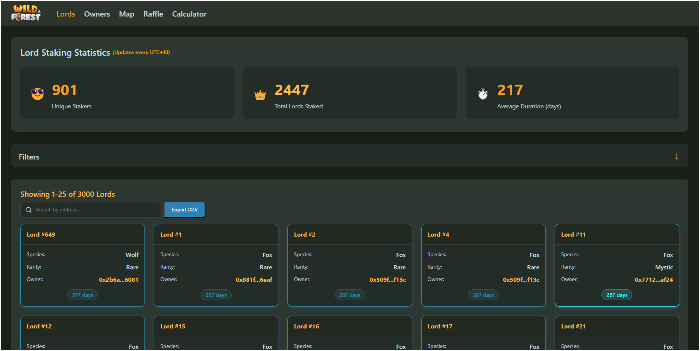

# Wild Forest Lords Dashboard

A comprehensive dashboard application for tracking, visualizing, and interacting with Wild Forest Lords NFTs on the Ronin blockchain.



## Features

### Lords Dashboard
- View total unique stakers and NFTs staked
- Track average staking duration
- Filter Lords by species (Wolf, Owl, Raven, Boar, Fox)
- Filter Lords by rarity (Rare, Epic, Legendary, Mystic)
- Sort Lords by staking duration or token ID
- Export data to CSV format

### Owners Dashboard
- View ownership statistics
- Track distribution of Lords by rarity
- Calculate and display raffle power for each owner
- Search and filter owners by address

### Interactive Stakers Map
- Visual representation of stakers and their staked Lords
- Interactive bubble visualization with drag and zoom functionality
- Stakers sized by their staking power
- Detailed view of each staker's NFT collection

### Raffle Organizer
- Create fair raffles based on staking power
- Add participant addresses manually or use all stakers
- Configure multiple prize categories with custom names
- Export winners list to CSV

### Level Calculator
- Calculate gold and shard requirements for unit leveling
- Support for all rarity tiers (Common to Mystic)
- Quick calculations for specific level targets

## Tech Stack

- **Frontend**: Next.js with TypeScript
- **Styling**: TailwindCSS
- **State Management**: React Hooks
- **Data Fetching**:
  - GraphQL (Marketplace API)
  - RPC (Ronin Chain)
- **Caching**: Redis
- **Deployment**: Vercel
- **Package Manager**: pnpm/yarn

## Getting Started

1. Clone the repository
   ```bash
   git clone https://github.com/yourusername/wild-forest-lords-dashboard.git
   cd wild-forest-lords-dashboard
   ```

2. Install dependencies
   ```bash
   pnpm install
   # or
   yarn install
   ```

3. Set up environment variables
   ```
   # Create a .env.local file with the following variables
   REDIS_URL=your_redis_connection_string
   X_API_KEY=your_marketplace_api_key
   ADMIN_API_KEY=your_admin_api_key
   ```

4. Start the development server
   ```bash
   pnpm dev
   # or
   yarn dev
   ```

5. Open [http://localhost:3000](http://localhost:3000) with your browser

## Project Structure

```
/src
  /components       # Reusable UI components
    /Calculator     # Level calculator components
    /Layout         # Layout components (Header, Footer)
    /Lords          # Lords dashboard components
    /Map            # Stakers map components
    /Owners         # Owners dashboard components
    /Raffle         # Raffle organizer components
  /hooks            # Custom React hooks
  /pages            # Next.js pages and API routes
  /services         # API communication with GraphQL and RPC
  /styles           # Global styles
  /types            # TypeScript interfaces and types
  /utils            # Utility functions
```

## Data Flow

1. User visits the application
2. Next.js API routes fetch data from Ronin blockchain via GraphQL and RPC calls
3. Data is cached in Redis to improve performance
4. UI components display the data with filtering and sorting capabilities
5. User interactions (filtering, refreshing) trigger new data fetches or use cached data

## API Endpoints

- `/api/staking-data` - Get staking information for Lords
- `/api/contract-balance` - Get the contract's NFT balance
- `/api/calculate-resources` - Calculate level-up resources
- `/api/refresh-cache` - (Admin) Invalidate and refresh the cache
- `/api/level-data` - (Admin) Update leveling calculator data

## Deployment

This project is configured for deployment on Vercel. To deploy your own instance:

1. Fork this repository
2. Create a new project on Vercel
3. Connect your forked repository
4. Set up environment variables in Vercel dashboard
5. Deploy

## Rate Limiting

The application includes rate limiting on API routes to prevent abuse.

## Mobile Support

Most features are responsive and work on mobile devices. The interactive map feature is desktop-only due to performance considerations.

## License

This project is licensed under the MIT License - see the LICENSE file for details.

## Credits

Created by Player 222 (medeasolon.ron)
